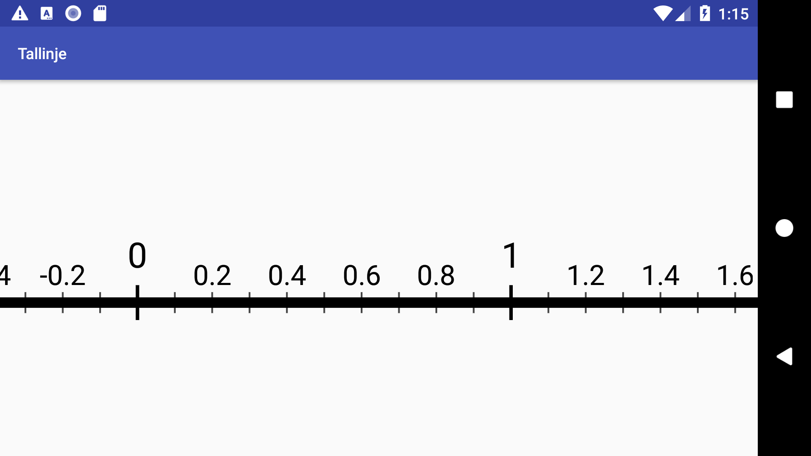

# Android Number Line
Android app that displays a number line.

The intention is to help my daughter learn about decimal numbers.

Install it from [Google Play](https://play.google.com/store/apps/details?id=com.gmail.walles.johan.tallinje).

Icons and play store graphics can be found in the `media` directory.

# TODO
* Color line differently left and right of zero
* Add fling gesture

## DONE
* Add scroll gesture
* Add zoom gesture
* Adapt step to the current scale
* Add the actual line
* Add tickmarks
* Add minor tickmarks
* Use smaller font for numbers above minor tickmarks
* Move minor labels closer to the line
